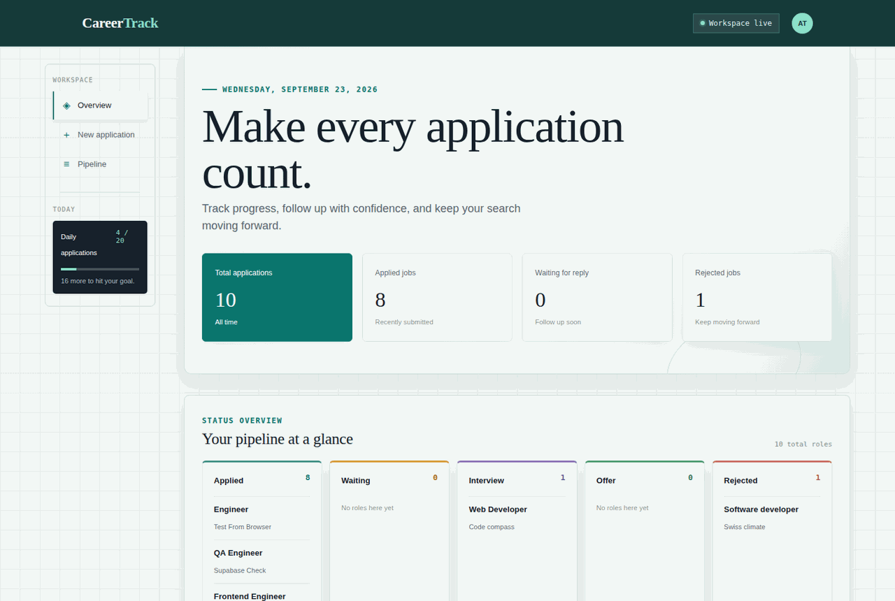

# CareerTrack

CareerTrack is a job-application tracking dashboard designed to help users stay organized throughout the job search process.

## Product overview

This project gives users a simple way to:

- track every job application in one place
- see the current status of each application
- review progress across the hiring pipeline
- keep follow-ups and decision stages organized
- monitor workload and daily activity trends

## App preview



## Key features

- Application dashboard with summary metrics
- Pipeline view by status stage
- Search and filtering for quick access
- Add new roles with company, role, location, salary, status, and link details
- Clean, mobile-friendly interface for browsing on the go

## Sample output

Example application record:

```json
{
  "company": "Northstar Labs",
  "position": "Frontend Engineer",
  "location": "Remote",
  "status": "WAITING",
  "salary": "$120k - $150k",
  "jobUrl": "https://example.com/jobs/1",
  "appliedAt": "2026-09-23"
}
```

Example dashboard summary:

```json
{
  "totalApplications": 42,
  "applied": 18,
  "waiting": 12,
  "interview": 7,
  "offer": 3,
  "rejected": 2
}
```

## Why this project matters

CareerTrack helps reduce the stress of managing multiple applications by turning a messy search into a clear, trackable workflow. It is especially useful for job seekers who want a lightweight system for staying consistent without juggling spreadsheets or scattered notes.

## Overview

This repository provides a streamlined public demo of the product. The static preview is available in public-site/, while the full implementation (TypeScript, React, Node.js, API, and database) remains in a private repository.

To preview the static files locally:

```bash
npx serve public-site
```

## Safety & Privacy

Sensitive files — including source code, environment variables, credentials, and application data — are intentionally excluded. Never commit API keys, tokens, or database credentials.

## Purpose

This repository is designed to highlight the product experience and workflow.
